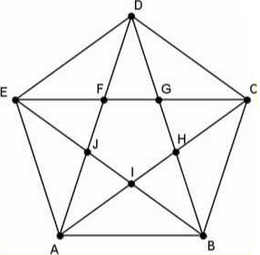

# GRAFOS

### ANDERSON MOREIRA

**EXERCÍCIO**

1. Implementação de funções básicas para manipulação de grafos: criar grafo, inserir arestas, inserir vértices, remover arestas, remover vértices, determinar o grau de um vértice, determinar se dois vértices são vizinhos, determinar se o grafo tem ciclo euleriano.

    _Recomendação: utilizar listas de adjacências._

2. Testar todas as funções com três grafos distintos (n>=8). Adicionalmente, enviar imagens dos grafos testados.

**IMPLEMENTADOS**

- [x] Criação de Grafo
- [x] Inserir Arestas
- [x] Inserir vértices
- [x] Remover arestas
- [x] Remover vertices
- [x] Determinar o grau de um vertice
- [x] Determinar se dois vértices são vizinhos
- [x] Determinar se o grafo tem ciclo euleriano
- [x] Imprimir o ciclo euleriano caso tenha.

**IMAGENS DOS GRAFOS TESTADOS**
##### OBS: Na implementação da estrutura de grafo os vértices são enumerados de 0 a v-1, sendo v o número de vértices;

#### Exemplo 1

#### Referência: <https://www.ecured.cu/Archivo:CicloEuleriano1.png>

#### Exemplo 2

#### Referência: <http://www.decom.ufop.br/marco/site_media/uploads/bcc204/19_aula_19.pdf>

#### Exemplo 3
 
#### Referência: <http://repositorio.ufes.br/bitstream/10/6471/1/Rone%20Mauri.pdf>

#### Exemplo 4

#### Referência: <https://www.inf.ufsc.br/grafos/temas/euleriano/euleriano.htm>

**OBSERVAÇÕES**
1. Dentro da pasta já existe um **programa.exe** basta executa-ló para vê os resultados. 
2. Caso faça alguma alteração em um dos arquivo terá que rodar o arquivo makefile para compilar 
e linkar todos os arquivos .c, .h e .o em programa.exe; Ou se preferrir poderá compilar aquivo 
por arquivo manualmente e depois linkar.
